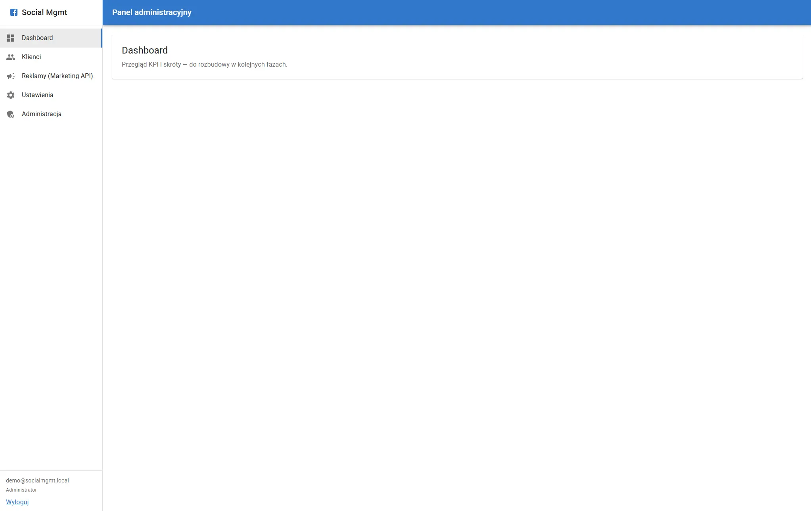

# Social Management

Monorepo aplikacji do zarządzania obecnością klientów w social media: integracja z Meta (Facebook / Instagram), kampanie Marketing API, moderacja treści i komentarzy oraz globalny filtr spamu.

## Podgląd



## Stack technologiczny

| Warstwa               | Technologie                                                                                        |
| --------------------- | -------------------------------------------------------------------------------------------------- |
| **Frontend**          | React 19, Vite, TypeScript, Material UI (MUI), React Router, React Hook Form, Zod, MUI X Data Grid |
| **Backend**           | Node.js, Express 5, TypeScript, Prisma ORM                                                         |
| **Baza danych**       | MySQL 8                                                                                            |
| **Infra (lokalnie)**  | Docker Compose (kontener MySQL)                                                                    |
| **Auth / integracje** | JWT (panel), OAuth Meta, Facebook Graph API, Marketing API                                         |
| **Testy / jakość**    | Vitest, Jest + MSW, Playwright (E2E), ESLint (client), Prettier                                    |

Struktura katalogów:

- `client/` — aplikacja SPA (Vite)
- `server/` — API REST + Prisma (`prisma/schema.prisma`)
- **`.env.example`** (katalog główny) i **`server/.env.example`** — szablony zmiennych; skopiuj do **`.env`** / **`server/.env`** (te pliki są w `.gitignore`).

Projekt używa **npm workspaces**: instalacja z katalogu głównego (`npm install`) tworzy **jeden** `package-lock.json` i umieszcza prawie wszystkie pakiety w **`node_modules` w korzeniu repozytorium**. W podfolderach `client/` lub `server/` mogą dodatkowo pojawić się niewielkie katalogi `node_modules` (np. linki binarek lub pakiety z inną wersją) — to typowe zachowanie npm i nie wymaga osobnego `npm install` w tych folderach.

## Wymagania

- **Node.js** 20+ (zalecane LTS)
- **npm** 9+ (workspaces)
- **Docker Desktop** (opcjonalnie, do uruchomienia MySQL w kontenerze)

## Pierwsza instalacja

1. Sklonuj repozytorium i przejdź do katalogu projektu.

2. Zainstaluj zależności **z katalogu głównego** (utworzy się jeden `package-lock.json` i `node_modules`):

   ```bash
   npm install
   ```

3. Przygotuj **hasło MySQL** dla Dockera i skopiuj szablony:
   - W katalogu głównym: skopiuj **`.env.example`** → **`.env`** i ustaw **`MYSQL_ROOT_PASSWORD`** (silne hasło; nie wrzucaj go do repozytorium).
   - W **`server/`**: skopiuj **`server/.env.example`** → **`server/.env`** i w **`DATABASE_URL`** użyj **tego samego hasła** co w `MYSQL_ROOT_PASSWORD` oraz portu **3307** (patrz niżej).

4. Uruchom bazę MySQL w Dockerze:

   ```bash
   docker compose up -d
   ```

   W `docker-compose.yml` MySQL z kontenera jest wystawione na hoście pod **`localhost:3307`** (mapowanie `3307:3306`), żeby **nie zajmować portu 3306** — na Windowsie często działa już osobna instalacja MySQL / XAMPP / inny Docker i wtedy pojawia się błąd `bind: ... 3306 ... Only one usage`.

5. Dokończ **`server/.env`** (wzoruj się na **`server/.env.example`**): **`JWT_SECRET`**, opcjonalnie **`TOKEN_ENCRYPTION_KEY`** (szyfrowanie tokenów Meta w DB — patrz [Bezpieczeństwo](#bezpieczeństwo)), **`CLIENT_URL`**, dane aplikacji Meta (`FACEBOOK_*`) jeśli używasz OAuth. W szablonie są też **`DEMO_ADMIN_EMAIL`** i **`DEMO_ADMIN_PASSWORD`** (konto z `npm run db:seed`) — możesz je zostawić albo zmienić przed seedem.

6. Wygeneruj klienta Prisma i zastosuj migracje:

   ```bash
   npm run db:generate
   npm run db:migrate
   ```

   (Odpowiednik: `cd server && npx prisma generate && npx prisma migrate dev`.)

7. Utwórz **konto demo administratora** w bazie (skrypt Prisma Seed):

   ```bash
   npm run db:seed
   ```

   Logowanie do panelu — patrz [Konto demo](#konto-demo-lokalne).

## Konto demo (lokalne)

Po `npm run db:seed` w tabeli `panel_users` istnieje (lub jest nadpisywane) konto **ADMINISTRATOR** z domyślnymi danymi:

| Pole       | Wartość                 |
| ---------- | ----------------------- |
| **E-mail** | `demo@socialmgmt.local` |
| **Hasło**  | `Demo_SocialMgmt_2026!` |

Zmienne **`DEMO_ADMIN_EMAIL`** i **`DEMO_ADMIN_PASSWORD`** są wpisane w **`server/.env.example`** — po skopiowaniu do `server/.env` masz je od razu w pliku; możesz je zmienić przed pierwszym `npm run db:seed`. Jeśli ich nie ma w `.env`, seed i tak użyje domyślnych wartości z README (te same co w szablonie).

Skrypt znajduje się w **`server/prisma/seed.ts`**. W środowisku produkcyjnym **nie** używaj tych domyślnych haseł — ustaw własne konto lub zmień hasło zaraz po wdrożeniu.

**„Nieprawidłowy email lub hasło” mimo seedu:**

1. **`DATABASE_URL` w `server/.env`** musi wskazywać **tę samą bazę**, w której działał `npm run db:seed` (ten sam host, port, nazwa bazy). Inna instancja MySQL = inni użytkownicy — wtedy ponów seed po poprawieniu URL albo uruchom seed na właściwej bazie.
2. Uruchom ponownie z katalogu głównego: `npm run db:seed` i sprawdź w konsoli komunikat `[seed] ... demo@socialmgmt.local`.
3. W **`server/.env`** nie ustawiaj `DEMO_ADMIN_EMAIL` / `DEMO_ADMIN_PASSWORD` na przypadkowe wartości, jeśli logujesz się danymi z tabeli powyżej — albo usuń te zmienne (domyślne z README), albo loguj się **dokładnie** tym emailem i hasłem, które ustawiłeś.
4. Hasło wpisuj **ręcznie** (czasem kopiowanie z PDF/markdown dodaje niewidoczne znaki). Ostatni znak to zwykły wykrzyknik `!` (ASCII).

## Uruchomienie (development)

Z **katalogu głównego** — frontend i backend równolegle:

```bash
npm run dev
```

Osobno:

```bash
npm run dev:client   # Vite — zwykle http://localhost:5173
npm run dev:server   # API — zwykle http://localhost:3001
```

Frontend proxy przekierowuje `/api` na backend (patrz `client/vite.config.ts`).

## Build produkcyjny

```bash
npm run build
```

- `client/dist/` — statyczny frontend
- `server/dist/` — skompilowany backend (`npm run start -w server` po buildzie)

## Testy

Wszystkie komendy uruchamiaj z **katalogu głównego** repozytorium (po `npm install`).

### Testy jednostkowe / integracyjne (backend + frontend)

Pełny cykl (najpierw backend Jest, potem client Vitest):

```bash
npm test
```

| Zakres                | Komenda                  | Opis                                                                                                     |
| --------------------- | ------------------------ | -------------------------------------------------------------------------------------------------------- |
| **Backend (Jest)**    | `npm run test -w server` | `server/src/**/*.test.ts` — m.in. `metaGraph` z mockami **MSW** (brak prawdziwych wywołań HTTP do Meta). |
| **Frontend (Vitest)** | `npm run test -w client` | Pliki `*.test.ts` / `*.test.tsx` w `client/`.                                                            |
| **CI (bez MySQL)**    | `npm run test:ci`        | Jest bez folderu `integration/` + Vitest — używane w GitHub Actions.                                     |

**Testy integracyjne API** ([Supertest](https://github.com/ladjs/supertest)): `server/src/integration/clients.integration.test.ts` — wymagają działającego MySQL (`DATABASE_URL` w `server/.env`). Sprawdzają m.in. `POST /api/clients`, walidację 401/400 oraz izolację `SocialAccount` między klientami.

```bash
npm run test:integration -w server
```

### Testy E2E (Playwright)

Scenariusze w `e2e/tests/` (logowanie do panelu, zakładka Klienci, DataGrid, drawer komentarzy Meta, widoczność przycisku „Usuń” dla admina vs marketing). Przed pierwszym uruchomieniem zainstaluj przeglądarki Playwright:

```bash
npx playwright install chromium
```

Uruchomienie E2E (buduje backend `dist/`, potem startuje API + Vite i odpala testy):

```bash
npm run test:e2e
```

Tryb interfejsu Playwright (debugowanie krok po kroku):

```bash
npm run test:e2e:ui
```

**Wymagania E2E:** `DATABASE_URL` w `server/.env`, działający MySQL; seed użytkowników i firmy testowej uruchamia się w `globalSetup` (`scripts/e2e-seed.ts`). Domyślne hasła/emaile są w skrypcie seedu lub nadpisywalne zmiennymi `E2E_*` (patrz `server/scripts/e2e-seed.ts`).

**Uwagi techniczne:**

- API w E2E jest uruchamiane jako **`npm run start -w server`** (skompilowany `node dist`), nie `tsx watch` — inaczej parsowanie JSON (body-parser / iconv) może się nie powieść przy logowaniu.
- `GET /api/health` jest publiczny (gotowość); Playwright czeka na ten endpoint przy starcie serwera.
- Jeśli porty **3001** lub **5173** są zajęte przez stare procesy `dev`, zatrzymaj je albo pozwól Playwright na `reuseExistingServer` (domyślnie w dev), aby nie kolidować ze startem.

### ESLint i Prettier

| Komenda                | Opis                                               |
| ---------------------- | -------------------------------------------------- |
| `npm run lint`         | ESLint w pakiecie `client` (`eslint.config.js`).   |
| `npm run format`       | Prettier — formatuje pliki w repozytorium.         |
| `npm run format:check` | Prettier — tylko sprawdzenie (np. przed commitem). |

Konfiguracja: `.prettierrc`, `.prettierignore` (m.in. `node_modules`, `dist`, `package-lock.json`).

### CI (GitHub Actions)

Workflow [`.github/workflows/ci.yml`](.github/workflows/ci.yml): **Node.js 22** (nie 18.x), `npm ci`, `npm run db:generate`, `npm run lint -w client`, `npm run format:check`, `npm run build`, `npm run test:ci`. Testy integracyjne z MySQL nie są w tej konfiguracji — uruchamiaj je lokalnie (`npm run test:integration -w server`).

## Przydatne skrypty (workspace `server`)

| Skrypt (z root)                       | Opis                                                               |
| ------------------------------------- | ------------------------------------------------------------------ |
| `npm run db:generate -w server`       | `prisma generate`                                                  |
| `npm run db:generate:clean -w server` | usuwa `node_modules/.prisma` + `prisma generate` (Windows / EPERM) |
| `npm run db:migrate -w server`        | `prisma migrate dev`                                               |
| `npm run db:push -w server`           | `prisma db push`                                                   |
| `npm run db:studio -w server`         | `prisma studio` (GUI)                                              |
| `npm run db:seed -w server`           | `prisma db seed` — konto demo (patrz wyżej)                        |

## Prisma (ORM i podgląd bazy)

[Prisma](https://www.prisma.io/) mapuje modele z pliku **`server/prisma/schema.prisma`** na tabele w **MySQL**. Wygenerowany klient (`@prisma/client`) jest używany w kodzie API; po każdej zmianie schematu uruchom migrację (lub `db:push` na dev) oraz ponownie **`npm run db:generate`**, żeby typy i klient były zsynchronizowane z bazą.

**Prisma Studio** to wbudowane w CLI **graficzne narzędzie** do przeglądania i edycji rekordów (filtrowanie, podgląd relacji) bez pisania zapytań SQL. Domyślnie otwiera się w przeglądarce pod adresem **`http://localhost:5555`** (port można zmienić flagą `--port`).

Uruchomienie z katalogu głównego repozytorium (wymaga poprawnego **`DATABASE_URL`** w `server/.env` i działającej bazy):

```bash
npm run db:studio
```

Równoważnie: `npm run db:studio -w server` albo `cd server && npx prisma studio`.

**Uwagi:** Studio jest przeznaczone głównie do **środowiska lokalnego / developerskiego**. Nie wystawiaj go publicznie w produkcji bez zabezpieczeń (VPN, tunel z autoryzacją itd.) — daje pełny dostęp do danych zgodnie z uprawnieniami użytkownika bazy z `DATABASE_URL`.

**Seed bazy:** `npm run db:seed` uruchamia `prisma db seed` i zapisuje konto demo administratora (szczegóły w sekcji [Konto demo](#konto-demo-lokalne)).

## Bezpieczeństwo

### Zmienne środowiskowe i sekrety

- **`server/.env`** nie powinien trafiać do repozytorium (jest w `.gitignore`). W produkcji ustaw m.in. `DATABASE_URL`, **`JWT_SECRET`** (min. długi, losowy), **`TOKEN_ENCRYPTION_KEY`** (preferowane 64 znaki hex = 32 bajty klucza AES) oraz dane Meta (`FACEBOOK_APP_ID`, `FACEBOOK_APP_SECRET`, `FACEBOOK_REDIRECT_URI` itd.).
- **`TOKEN_ENCRYPTION_KEY`**: szyfrowanie tokenów Meta (`access_token` / `refresh_token` w tabeli `social_accounts`) algorytmem **AES-256-GCM** przed zapisem w MySQL. Wartość w DB ma prefiks `smenc:v1:`; stare wpisy w plaintext nadal są obsługiwane przy odczycie.
- Jeśli `TOKEN_ENCRYPTION_KEY` nie jest ustawiony, klucz szyfrowania jest **pochodzony z `JWT_SECRET`** (wygodniejsze na dev, w produkcji lepiej osobny klucz).
- Frontend nie powinien zawierać sekretów aplikacji Meta ani kluczy API — konfiguracja zostaje po stronie serwera lub zmiennych buildu (`VITE_*` tylko tam, gdzie celowo wystawiasz nie-sekretowe identyfikatory).

### Autoryzacja API

- Większość tras pod `/api/clients` i `/api/clients/:id/meta` wymaga nagłówka **`Authorization: Bearer <JWT>`** (panel: role ADMINISTRATOR lub MARKETING).
- **`/api/admin/*`** — wyłącznie rola **ADMINISTRATOR**.
- **`GET /api/health`** — publiczny (np. healthcheck / orchestracja).
- **`GET /api/db-check`** — **JWT + rola ADMINISTRATOR** (diagnostyka bazy; nie udostępniaj publicznie).
- **OAuth Meta** (`/api/auth/*`, w tym redirect callback) — publiczne tylko tam, gdzie wymaga tego przepływ przeglądarki; logowanie do panelu (`POST /api/auth/login` itd.) nie wymaga wcześniejszego JWT.

### Sesja w przeglądarce

- Token panelu jest przechowywany w **localStorage** (`sm_token`). Utrzymuj aktualne zależności i unikaj XSS (np. nie wstrzykuj nieufnego HTML do DOM).

## Rozwiązywanie problemów

### Docker i MySQL

- **`ports are not available` / `bind` na porcie 3306** — na hoście działa już inna usługa na **3306** (np. systemowy MySQL, XAMPP, MariaDB). W repozytorium Docker mapuje kontener na **`localhost:3307`** (`3307:3306` w `docker-compose.yml`). Ustaw w `DATABASE_URL` port **3307** i zrestartuj kontener po `git pull`: `docker compose down` → `docker compose up -d`.
- Jeśli **wolisz port 3306** i masz pewność, że nic na nim nie nasłuchuje, możesz w lokalnym `docker-compose.yml` (nie commituj, jeśli to tylko u Ciebie) przywrócić `"3306:3306"`.

### Prisma na Windows (`EPERM` / `rename` / `query_engine-windows.dll.node`)

Ten błąd przy `npm run db:generate` zwykle oznacza, że **inny proces trzyma zablokowany** plik silnika Prisma (`.dll`), więc nie da się go nadpisać.

1. **Zatrzymaj** wszystko, co może ładować Prisma: `npm run dev`, `npm run dev:server`, **Prisma Studio**, testy, inne terminale z Node w tym projekcie.
2. W **Menedżerze zadań** zamknij zbędne procesy **Node.js** (ostrożnie — nie zamykaj innych aplikacji, których potrzebujesz).
3. Uruchom ponownie generowanie z **czyszczeniem** wygenerowanego katalogu:

   ```bash
   npm run db:generate:clean
   ```

   (Usuwa `server/node_modules/.prisma` i ponownie uruchamia `prisma generate`.) Jeśli **nawet usuwanie folderu** kończy się `EPERM`, blokada nadal jest aktywna — wróć do punktu 1–2 albo zamknij edytor i otwórz nowy terminal.

4. Jeśli nadal jest `EPERM`: **Windows Defender / antywirus** — dodaj wyjątek dla folderu projektu lub tymczasowo wyłącz skanowanie na czas `db:generate`. Unikaj też synchronizacji projektu przez **OneDrive** w tle (lepiej katalog poza folderem „OneDrive”).

5. Ostatnia deska ratunku: zamknij **Cursor/VS Code**, otwórz **PowerShell jako administrator** w katalogu projektu i wykonaj `npm run db:generate:clean`.

## Uwagi

- Sekrety trzymaj wyłącznie w `server/.env`; nie commituj plików `.env`.
- Po zmianach w `server/prisma/schema.prisma` uruchom migrację lub `db:push` oraz ponownie `db:generate`.
